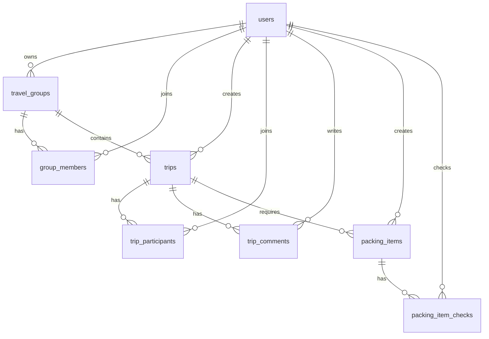

# Project Description: Travel Group Organizer

Travel Group Organizer app is a software product for planning and managing group trips.
The app allows users to create travel groups, plan trips, manage participants, discuss details

## Roles in the App
Visitor:
- Description: Anonymous user
- Can:
    - view home page
    - register
    - login

User:
- Description: Authenticated user
- Can:
    - manage own profile
    - create travel group (after creating a group, becomes the group manager)
    - view groups where is a member
    - create personal travel preferences
    - create trip comments,
    - marks the packing  list

- Profile fields:
    - name
    - email

Member:
- Description: Travel Group Member, a user who joined a travel group by adding the group manager
- Can:
    - view group trips
    - view trip details
    - join / leave a trip
    - comment on trips
    - view packing list and check

Manager:
- Description: Travel Group Manager, Manager of a travel group
- Can:
    - create/edit/cancel/delete trips
    - registers members through their email adress
    - remove members from group
    - manage packing checklist

## Travel Groups
Description: Travel groups represent communities of people who travel together.

Each group has:
- name
- description
- visibility: private
- created by
- managers
- members

## Trips
Description: Trips are the main planned travel events.

Each trip has:
- title
- description
- destination
- start date
- end date
- meeting point
- capacity
- estimated budget
- canceled: yes/no
- visibility: private
- created by manager of the group

Trip states:
- upcoming — trip has not started yet
- current — current date is between start date and end date
- past — trip end date has passed
- canceled — trip was canceled by manager

Capacity states:
- under capacity
- full capacity
- over capacity

## Packing List:
- Description: Each trip can have a shared packing checklist.
- Sample items:
    - passport / ID
    - swimsuit
    - hiking shoes
    - jacket
    - medicine
    - power bank
    - snacks

- Features:
    - managers create global packing list
    - members mark items as packed for themselves

## Web App Scope

The Web app is the primary application and implements the full functionality.

Web features:

- landing page
- register/login
- dashboard
- profile management
- create groups
- create/edit/cancel/delete trips
- trip details page
- participants detais
- join/leave trip
- comments
- packing list management

## Mobile App Scope

The mobile app is a smaller companion app for travelers, which implements only the most important group member functionality:

- login/register
- view upcoming/current/past trips
- trip details
- join/leave trip
- view and post participants
- view and post comments
- view and sheck packing list

# Project Documentation

## Architecture

Travel Group Organizer is organized as an npm workspace monorepo with separate applications for the web and mobile clients.

- `travel-web` is the primary full-stack application. It uses Next.js App Router with React and TypeScript for the web UI, server actions for web workflows, and REST API route handlers under `/api` for the mobile client.
- `travel-mobile` is an Expo React Native companion app. It uses Expo Router screens and calls the web application's REST API.
- The database is PostgreSQL hosted through Neon and accessed from the web app with Drizzle ORM.
- Authentication uses email/password credentials, bcrypt password hashing, JWT tokens signed with `JWT_SECRET`, and an HTTP-only `travel_session` cookie for the web app. The mobile app stores and sends a bearer token to protected API routes.
- API CORS headers are configured in the web app and can be restricted with `API_CORS_ORIGIN`.

Main technology stack:

- Front-end web: Next.js, React, TypeScript, Tailwind CSS.
- Mobile: Expo, React Native, Expo Router, TypeScript.
- Back-end: Next.js API routes and server actions.
- Database: PostgreSQL, Neon serverless driver, Drizzle ORM, Drizzle Kit migrations.
- Authentication/security: bcrypt, jose JWT.
- Tooling: npm workspaces, ESLint, TypeScript.

High-level request flow:

```text
Browser
  -> Next.js pages / server actions
  -> Drizzle ORM
  -> Neon PostgreSQL

Expo mobile app
  -> /api REST endpoints in travel-web
  -> Drizzle ORM
  -> Neon PostgreSQL
```

## Database Schema Design

The database schema is defined in `travel-web/src/db/schema.ts`, with migrations stored in `travel-web/drizzle`.

Tables used in the database:

- `users`: stores registered user accounts and authentication data.
- `travel_groups`: stores travel communities created by users.
- `group_members`: connects users to travel groups and stores their group role, either member or manager.
- `trips`: stores planned travel events that belong to a travel group.
- `trip_participants`: connects users to trips and stores guest counts plus travel preferences.
- `trip_comments`: stores discussion messages for trips.
- `packing_items`: stores the shared packing checklist items for a trip.
- `packing_item_checks`: stores each user's checked/packed state for packing items.



## Local Development Setup

Prerequisites:

- Node.js 22 or compatible recent Node.js version.
- npm.
- A PostgreSQL database connection string. The project is configured for Neon PostgreSQL.

Install dependencies from the repository root:

```bash
npm install
```

Create `travel-web/.env`:

```env
DATABASE_URL="postgresql://..."
JWT_SECRET="replace-with-a-long-random-secret"
API_CORS_ORIGIN="*"
```

Create `travel-mobile/.env` when the mobile app should use a specific API server:

```env
EXPO_PUBLIC_API_BASE_URL="http://localhost:3000/api"
```

For Android emulator development, the mobile app falls back to `http://10.0.2.2:3000/api`. For other platforms it falls back to `http://localhost:3000/api`.

Run database migrations:

```bash
npm --workspace=travel-web run db:migrate
```

Optionally seed sample data:

```bash
npm --workspace=travel-web run db:seed
```

Run both web and mobile apps:

```bash
npm run dev
```

When running the mobile app in web mode, the Expo mobile web preview is usually available at:

```text
http://localhost:8081/
```

The web app and API still run separately at:

```text
http://localhost:3000/api
```

Run only the web app:

```bash
npm --workspace=travel-web run dev
```

Run only the mobile app:

```bash
npm --workspace=travel-mobile run start
```

Useful validation commands:

```bash
npm run lint
npm run build
```

The web app API documentation is available locally at:

```text
http://localhost:3000/api/docs
```

## Key Folders and Files

- `package.json`: root workspace configuration and shared scripts for development, build, and linting.
- `package-lock.json`: locked dependency graph for the whole workspace.
- `netlify.toml`: Netlify build configuration for exporting and publishing the mobile web build from `travel-mobile/dist`.
- `travel-web/package.json`: web app dependencies and scripts, including Drizzle migration and seed commands.
- `travel-web/src/app`: Next.js App Router pages, layouts, server actions, and API route handlers.
- `travel-web/src/app/api`: REST API endpoints used mainly by the mobile app.
- `travel-web/src/components`: reusable web UI components such as forms, navigation, trip cards, and dashboard widgets.
- `travel-web/src/db/schema.ts`: Drizzle database schema, relations, enums, constraints, and indexes.
- `travel-web/src/db/index.ts`: Neon and Drizzle database client setup.
- `travel-web/src/db/seed.ts`: sample data loader for local/demo development.
- `travel-web/drizzle`: generated SQL migrations and Drizzle metadata snapshots.
- `travel-web/src/lib/auth.ts`: password hashing, JWT creation/verification, cookie session handling, and current-user lookup.
- `travel-web/src/lib/api`: shared API helpers for authentication, CORS, responses, and trip data formatting.
- `travel-web/src/services`: server-side service modules for dashboard, groups, and trips.
- `travel-web/src/proxy.ts`: request proxy/middleware-style authentication guard logic.
- `travel-web/src/app/globals.css`: global styling and Tailwind CSS entry point.
- `travel-mobile/package.json`: Expo app dependencies and scripts.
- `travel-mobile/src/app`: Expo Router screens for login, register, trips, groups, profile, trip details, and packing.
- `travel-mobile/src/components`: reusable mobile UI components such as the bottom navigation.
- `travel-mobile/src/lib/api.ts`: typed client functions for calling the web app REST API.
- `travel-mobile/src/lib/auth-context.tsx`: mobile authentication context and token state.
- `travel-mobile/src/lib/use-require-auth.ts`: route-level mobile authentication helper.
